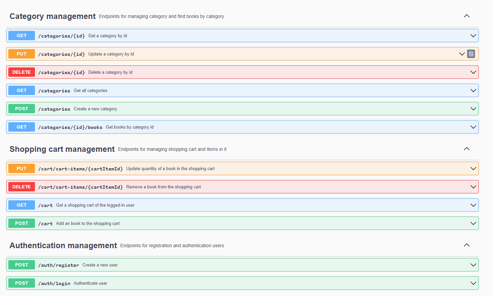

# Legacy of Tacitus - online book store


## Description

"Legacy of Tacitus" -
This is an online bookshop that enables users to enjoy a wide selection of literary masterpieces as a common heritage, 
immersing themselves in the world of books and discovering new gems to read.

## Main Features

### Search and Filtering
Convenient search functionality, along with the ability to filter by titles, authors, and categories, helps users find books quickly and efficiently.

### Registration and Authentication
A simple registration process that allows users to create an account.

### Security and Confidentiality
Assurance of the confidentiality of personal information and user security.

### Programming Languages
Java JDK version: 17

### Technologies
- Spring Boot
- Spring Security
- Spring Data JPA
- Spring MVC
- Swagger
- JWT
- Liquibase
- Lombok
- Mapstruct
- MySQL
- Maven
- Docker

### Features
  #### user:
- registration/authentication user
#### book:
- create/get/update/(soft)delete a book
- create a list of books
- get a list of all books
- search books by title, author or category
#### category:
- create/get/update/(soft)delete a category
- get a list of all categories
#### shopping cart:
- shopping cart is created and assigned to the user during registration
- Operations on the cart of an authorized user:
  - get
  - add/remove a book
  - update quantity of book
#### order:
- creating an order based on the shopping cart
- get all orders of the logged-in user
- Operations on orders:
  - update status
  - get a list of order-items
  - get a one item
    
    

### Startup instructions
#### easy way:

- your computer must have [docker](https://www.docker.com/products/docker-desktop/) installed.
- create a new directory and download [docker-compose.yml](foreasy/docker-compose.yml) from [foreasy](foreasy/) package
- in the same directory create ".env" file. For example:
```
MYSQL_USER=userr
MYSQL_ROOT_PASSWORD=qwer
MYSQL_PASSWORD=qwer
MYSQL_DATABASE=online_shop_db
MYSQL_LOCAL_PORT=3307
MYSQL_DOCKER_PORT=3306

SPRING_LOCAL_PORT=8088
SPRING_DOCKER_PORT=8080
DEBUG_PORT=5005
```
- in the terminal, being in this folder, enter the command:
```bash
docker compose up
```
#### or the JAR build path:
- your computer should still have [docker](https://www.docker.com/products/docker-desktop/) installed.
- Clone this repository.
- Create a .env file in the root folder.
- if Maven is not installed on your machine, you can download and install it from the [Maven website](https://maven.apache.org/download.cgi).
- in the terminal, being in book-store folder, enter the command:
```bash
mvn package
```
- and finally:
```bash
docker compose up
```
#### after launch:
- you will be able to send http requests to the port SPRING_LOCAL_PORT specified in the .env file
- for example, you can open the page in your browser at http://localhost:8088/api/swagger-ui/index.html 
where 8088 = SPRING_LOCAL_PORT specified in the .env file by default. Or use [Postman](https://www.postman.com/downloads/).
- ###### Any path starts with /api.

### Postman

- Here I have prepared a collection for Postman. For convenience, the SPRING_LOCAL_PORT is set to the default value of 8088.
- Thanks to this collection, you can test the functionality of the application in a very clear and detailed manner.
- Import this file into your Postman.
[book store requests postman collection](Book%20store%20requests.postman_collection.json)
### Technical details

It's worth noting that the application implements a role system with USER and ADMIN roles. 
Some functionality is only accessible with administrator privileges, namely:
- create/create all/delete/update book 
- create/delete/update category
- update order status

All other functionality is accessible to everyone. 
There is a default user created with administrator privileges: 
- name: admin@example.com
- password: 1234


You can modify the default users created in this file: [insert_users](src/main/resources/db/changelog/changes/06-insert-users-table.yml)

###### [This is a short video about app)](https://www.loom.com/share/d5af3f8d85a944f38f6f8345df575bac?sid=6a1ff61e-79ad-4e3f-8cd5-58d36325b2de)